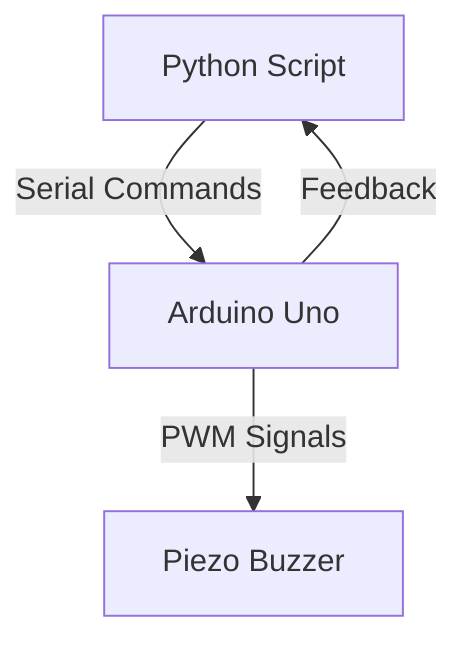

# System Patterns & Architecture

## System Architecture Flow



## Communication Protocol

### Message Format
- **Encoding**: UTF-8 text commands terminated with `\n`
- **Baud Rate**: 9600 baud (consistent between Python and Arduino)
- **Timeout**: 1 second for serial operations
- **Commands**: Single-word ASCII commands

### Command Dictionary

#### BEEP
- **Purpose**: Play musical sequence
- **Implementation**: Multiple `tone()` calls with delays
- **Response**: "Tone sequence played\n"
- **Duration**: ~850ms total (150Hz-200ms + 120Hz-200ms + 200Hz-300ms)

#### BEEP_ON
- **Purpose**: Continuous tone (compatibility)
- **Implementation**: `tone(pin, 440, 0)` - continuous 440Hz
- **Response**: "Tone ON (440Hz)\n"

#### BEEP_OFF
- **Purpose**: Stop all tones
- **Implementation**: `noTone(pin)`
- **Response**: "Tone OFF\n"

#### HELLO
- **Purpose**: Connection test
- **Implementation**: Serial echo response
- **Response**: "Hello from Arduino!\n"

## Hardware Connections

### Arduino Uno Pin Configuration
```
Pin 9 (PWM) ---- Buzzer (+) Terminal
GND ----------- Buzzer (-) Terminal
```

### Serial Port Setup
```
COM6 @ 9600 baud
8 data bits, 1 stop bit, no parity
Timeout: 1 second
```

## Software Architecture Patterns

### Arduino Sketch Structure
1. **Pin Definitions**: Compile-time constants using `#define`
2. **Setup Section**: Serial initialization and pin mode configuration
3. **Event Loop**: Non-blocking serial command processing
4. **Command Parser**: String-based command matching with trim()

### Python Control Pattern
1. **Connection Management**: Try/except block for serial operations
2. **Command Helper**: `send_buzzer_command()` wrapper function
3. **Timing Control**: `time.sleep()` for Arduino readiness delays
4. **Error Handling**: SerialException and general Exception catching

## Tone Generation Strategy

### tone() Function Usage
- **Parameters**: `tone(pin, frequency, duration)`
- **Frequency Range**: 31Hz - 65535Hz (Arduino Uno limit)
- **Duration**: 0 = continuous, 1-65535ms = timed
- **PWM Output**: Square wave generation via Timer/Counter

### Musical Sequence Design
- **Ba** (150Hz): Low bass note for sequence start
- **Dum** (120Hz): Lower pitch for rhythm emphasis
- **Tss** (200Hz): Higher pitch for sequence completion
- **Timing**: Overlap-free with pauses between notes

## Error Handling Patterns

### Arduino Side
- **Serial Buffer**: `Serial.readStringUntil('\n')` with timeout
- **String Processing**: `trim()` for whitespace removal
- **Pin Safety**: PWM-capable pins only for tone output

### Python Side
- **Connection Errors**: `serial.SerialException` handling
- **Timeout Protection**: 10-second total connection attempt limit
- **Graceful Shutdown**: Always close serial connection

## Extensibility Patterns

### Adding New Commands
```arduino
else if (command == "NEW_COMMAND") {
    // Command implementation
    Serial.println("Command response\n");
}
```

### Adding New Tones/Nodes
```arduino
tone(BUZZER_PIN, 523, 200);  // C5 note
tone(BUZZER_PIN, 659, 200);  // E5 note
tone(BUZZER_PIN, 784, 200);  // G5 note
```

### Multiple Buzzer Support
- Use additional PWM pins (3, 5, 6, 10, 11)
- Create pin arrays and iterate tone commands
- Command format: "BUZZER2_ON" for multiple device control

## Performance Characteristics

### Arduino Resource Usage
- **Flash Memory**: 5330 bytes (16% of 32KB)
- **RAM**: 347 bytes (16% of 2KB)
- **CPU Overhead**: Minimal (tone handled by hardware timer)

### Communication Latency
- **Command Send**: ~100ms buffer delay
- **Sound Response**: Near instantaneous
- **Serial Round-trip**: <200ms total

### Power Profile
- **Active Tone**: ~20-40mA buzzer current
- **Idle**: ~20mA Arduino baseline
- **PWM Duty Cycle**: 50% for audio tone waveforms
